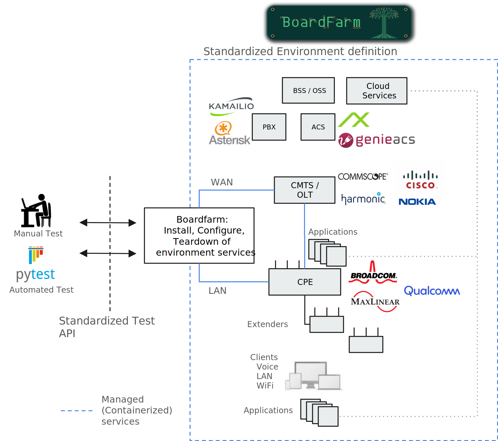
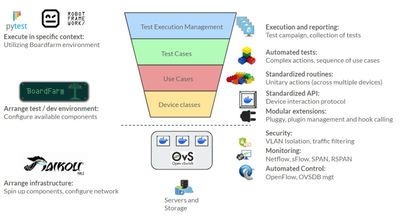

# Boardfarm Introduction

**Boardfarm** is an enterprise-grade, open-source test automation framework designed for comprehensive testing of cable modems, gateways, and telecommunications infrastructure. The framework implements a **"build once, use many times"** philosophy through sophisticated abstraction layers, enabling the same test suite to execute across diverse hardware vendors, deployment environments, and network configurations.

## Context Diagram

## Architecture Diagram

---

## 1. History
- Originally developed by a Qualcomm team approximately 10 years ago
- Initial purpose: automated router testing
- **Core concept**: Farm of boards in a rack that can be:
  - Selected and powered up
  - Connected to via serial port or SSH
  - Automated using the expect CLI automation tool
- **Environment simulation**:
  - Spins up small Debian containers acting as WAN and LAN devices
  - WAN device performs DHCP-based configuration
  - LAN device runs different network client actions
- **Build integration**: Firmware upgrades triggered by Jenkins build server releases
- Written in Python and Bash
  - Python: Convenient, easy to learn, large ecosystem
- **Evolution**: Dramatically expanded capabilities and architecture
- Now manages virtually every back office equipment component in full end-to-end lab environments
- Provides dedicated support functions for test cases

## Core Technology
- **Built around**: Python Expect module
  - Automates interactive command-line applications
  - Spawns processes, waits for expected output patterns
  - Sends responses automatically
- **Common uses**: SSH/FTP sessions, CLI programs, interactive applications, prompt handling

## Maintenance & Development
- Extended by dedicated team within Liberty Global
- Actively maintained by core team within Infosys
- Powerful and flexible architecture enables reuse across different environments (e.g., Charter)

## Testing Capabilities
- **Range**: Simple (ping google.com) to complex (ICMP packet analysis, WebUI visual regression)
- **Tools integration**: Selenium, image analysis tools
- **External integrations**: CDRouter, Robot Testing Framework

## 2. Architecture

### Core Concepts
- **Built around**: Devices and a central Device Manager
- **Device representation**: Components in end-to-end test environment
  - CPE device
  - ACS (Auto Configuration Server)
  - LAN client
- **Goal**: Standardize interfaces across all components

### Device Management
- Manages diversity of different vendors and configurations
- Dynamic test environment management
- Automatic version selections through smart configurations
- **Extensibility**: New devices based on templates and Abstract Base Classes
- Device classes that can be inherited and customized

## 3. Pytest Integration

### Pytest Framework
- Popular Python testing framework
- Simple to use, powerful and flexible
- **Features**:
  - Automatic test discovery
  - Extensive plugin ecosystem
  - Enhanced reporting

### Pytest Fixtures
- Core feature providing test data, resources, and preconditions
- Reusable components that prepare test environment

### Integration Architecture
- **Components**: pytest → pytest-boardfarm plugin → boardfarm
- **Flow**:
  1. Pytest loads pytest-boardfarm plugin
  2. Tests access devices via Device Manager through Python fixture
  3. Simple code to interact with devices (e.g., read datamodel parameters)

### Key Features
- Seamless integration with Pytest and Robot Framework
- Environment presented as a fixture
- **Lifecycle management**:
  - Participates in full reboot and provisioning scheme
  - Uses hooks that run during lifecycle phases
  - Manages boot/provision lifecycle via device hooks

### Connectivity
- **Connection library support**:
  - Serial
  - SSH
  - Telnet
  - SNMP
  - CLI connections

### Container Orchestration
- Manages Docker application containers
- Manages Linux system containers
- Minimizes hardware infrastructure requirements and bottlenecks
- Automated instantiation (install, config, teardown) of test environments across embedded and cloud systems

## Core Principles
- **Test case portability**: Build once, use many times
- **Minimize operational cost** via standard test APIs
- **Maximize reuse** of automated regression tests
- **Vendor flexibility**: Support transition using vendor-specific interfaces when needed
- **Extensible** through plugin architecture
- Add new device classes based on templates

## 4. Test Suite

### Test Components
- Test cases
- Test helpers
- Test stubs
- Test config files
- Test data

### Test Suite Status
- Being opened as open source
- Vendor and OEM specific extensions being refactored
- **Approximately 600 test cases** organized into categories:
  - TR-069
  - Web interface
  - Telemetry
  - Voice
  - Stability
  - DOCSIS provisioning
  - RDK-B specific (e.g., self heal)

### Architecture Layers
- **Use-case building blocks** enable fast automation scripting
- **Test execution management**:
  - **Test Cases**: Complex actions as sequence of use cases
  - **Use Cases**: Standardized compound routines unitary across devices
  - **Device Classes**: Standardized API, device interaction protocol
  - **Modular Extensions**: Plugin management and hook calling

### Framework Layers (Top to Bottom)
1. Test Cases
2. Use Cases (Reusable Blocks)
3. Pytest Fixtures (Device Manager)
4. Device Templates (Abstract Interfaces)
5. Vendor Plugins (Concrete Implementations)

## 5. Test Primitives
- (Additional details to be provided)
